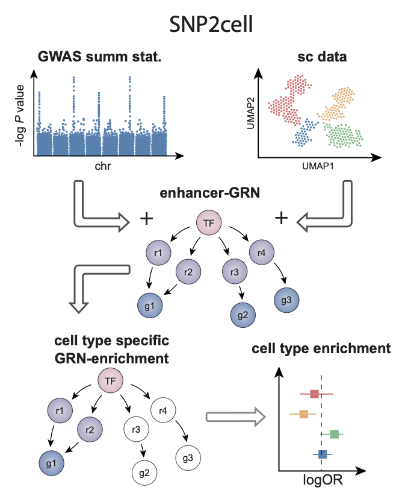

# snp2cell

`snp2cell` is a package for identifying gene regulation involved in specific traits and cell types.
It combines three elements: (i) GWAS summary statistics, (ii) single cell data and (iii) a base gene regulatory network.

A network propagation approach is used to integrate and overlap different types of scores on the network.
Random permutations of scores are then used to evaluate the significance of high scores. 

As an output, a networkx graph of the gene regulatory network with integrated scores can be used to inspect gene regulatory programs that are linked to the trait (from GWAS) on a per cell type basis.



## Installation

*Optional: create and activate a new conda environment (with python<3.12):*
```commandline
mamba create -n snp2cell python<3.12
mamba activate snp2cell
```

Install snp2cell:
```commandline
pip install git+ssh://git@github.com/JPatrickPett/snp2cell.git
```

## Usage

snp2cell can be imported as a python module (see [notebooks](https://github.com/Teichlab/snp2cell/edit/main/README.md#Example-notebooks) for examples).

Additionally, there is also a command line interface:
```commandline
snp2cell --help
```

Optionally, activate autocompletion for the command line tool.
E.g. for bash run:
```commandline
snp2cell --install-completion bash
. ~/.bashrc
```

## Example notebooks

- [toy example](https://github.com/Teichlab/snp2cell/blob/main/docs/source/toy_example.ipynb)
- [pbmc example](https://github.com/Teichlab/snp2cell/blob/main/docs/source/pbmc_example.ipynb)

## Citation

*to be added*
